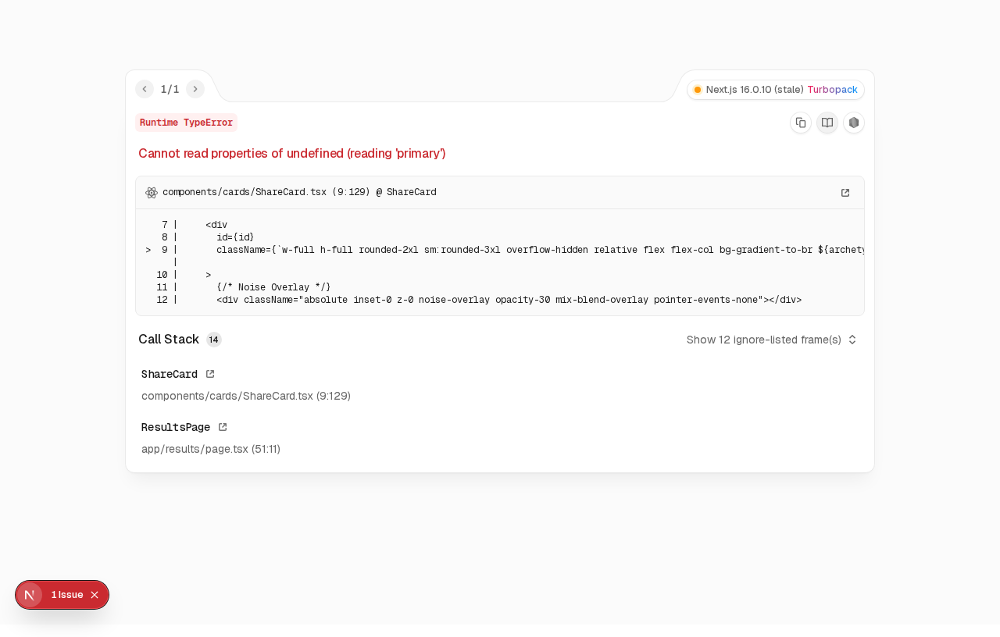

# SoundSelf — Spotify Personality Analyzer

SoundSelf is a deep personality analysis web app built on top of the Spotify API. It goes beyond the surface-level statistics of Spotify Wrapped to classify your listening habits into 10 distinct archetypes, map your mood to an emotional spectrum grid, extract your Genre DNA, and generate a personalized "Music Alter Ego."

## Features

- **Spotify OAuth Integration:** Secure, server-side authentication using HttpOnly cookies to keep your tokens safe.
- **Deep Personality Algorithm:** Calculates averages from Spotify Audio Features (`valence`, `energy`, `danceability`, `acousticness`, etc.) to map you to one of 10 highly-detailed archetypes (e.g., "The Euphoric Escapist", "The Midnight Philosopher").
- **Mood Spectrum Engine:** Plots your audio features onto a 2D emotional grid to determine your mood label and visual signature.
- **Genre DNA Chart:** Animated donut charts visualizing your macro and micro listening genres using Recharts.
- **Frictionless Export & Sharing:** Uses `html2canvas` to let users capture their generated card as an image. Results can also be shared via minified URL parameters, allowing friends to view your card without needing to log in.
- **Beautiful UI:** Polished with TailwindCSS gradients, SVG noise filters, and Framer Motion animations to make the experience feel premium.

## Screenshots

### Landing Page


### Results Dashboard


### Shareable Card View


## Tech Stack

- **Frontend:** Next.js (App Router), React, Tailwind CSS, Framer Motion
- **Data Visualization:** Recharts
- **Image Export:** html2canvas, js-confetti
- **Backend/API:** Next.js Server Actions & API Routes, Spotify Web API

## Local Setup

1. **Clone the repository and install dependencies:**
   ```bash
   git clone <repository_url>
   cd <repository_dir>
   pnpm install
   ```

2. **Set up Spotify Developer Application:**
   - Go to the [Spotify Developer Dashboard](https://developer.spotify.com/dashboard)
   - Create an app and set the Redirect URI to `http://localhost:3000/api/auth/callback`
   - Get your Client ID and Client Secret.

3. **Configure Environment Variables:**
   Create a `.env.local` file in the root directory:
   ```env
   SPOTIFY_CLIENT_ID=your_client_id_here
   SPOTIFY_CLIENT_SECRET=your_client_secret_here
   NEXT_PUBLIC_APP_URL=http://localhost:3000
   ```

4. **Run the Development Server:**
   ```bash
   pnpm run dev
   ```

5. Open [http://localhost:3000](http://localhost:3000) in your browser.